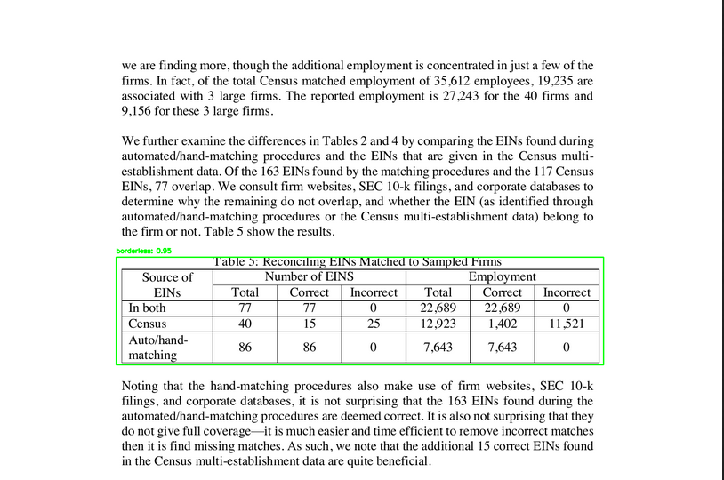

A# 🚀 Setting up and Running YOLOv8 using FastAPI --fastapi_yolo

Ensure you have all the prerequisites and follow the instructions below to set up and run fastapi_yolo.

## 📋 Prerequisites

1. **Docker**: Ensure Docker is installed on your machine.
   - 📥 [Download and install Docker](https://www.docker.com/get-started)
   
2. **Docker Compose**: It's usually bundled with Docker Desktop installations. For Linux, you might need to install it separately.
   - 📖 [Docker Compose Installation Guide](https://docs.docker.com/compose/install/)

## 🛠️ Instructions

1. **Clone the Repository**: 
   
   If the project is stored in a git repository, start by cloning it:
   ```bash
   git clone MittalMonika/YOLOv8_fastapi && cd YOLOv8_fastapi
   ```

2. **Build and Start the Services**: 

   To build the necessary Docker images and start the services, run:
   ```bash
   docker-compose up --build
   ```

3. **Accessing the Application**: 

   Once the services are up and running, you can access the application at:
   [Link for fastapi webpage](http://127.0.0.1:8080/docs#/default/process_pdf_process_pdf__post)
   

4. **Stopping the Services**: 

   When you're done, you can stop the services by pressing `CTRL + C` in the terminal. Alternatively, if you started the services in detached mode (`docker-compose up -d`), you can stop them with:
   ```bash
   docker-compose down
   ```

## 🖼️ Images
The output when toggle to application link would be 
```markdown

```
```markdown

```
```markdown

```


