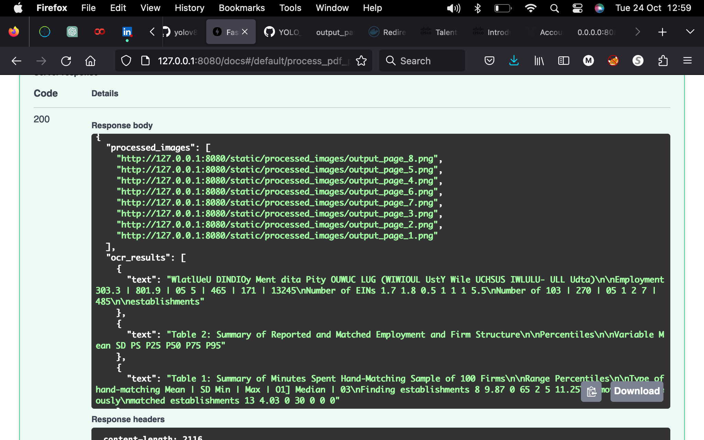

🚀 ** YOLOv8 & FastAPI Object Detection !**

This repository bridges the power of YOLOv8 — a renowned real-time object detection model — with the agility of FastAPI, a contemporary web framework known for its stellar performance in building APIs. Beyond just a model and a framework, we've integrated Docker for seamless building, shipping, and running of distributed applications.

One of the key features of this project is its capability to handle documents. We've developed a mechanism where tables within documents are meticulously tagged. Post tagging, these tables undergo Optical Character Recognition (OCR) to extract and display their content, ensuring precise data retrieval.

Leverage this repository as a solid starting point for object detection ventures or simply to understand the integration of these cutting-edge technologies.


## 🚀Setting up and Running YOLOv8 using FastAPI 
Ensure to have all the prerequisites and follow the instructions below to set up and run fastapi_yolo.

## 📋 Prerequisites

1. **Docker**: Ensure Docker is installed on your machine.
   - 📥 [Download and install Docker](https://www.docker.com/get-started)
   
2. **Docker Compose**: It's usually bundled with Docker Desktop installations. For Linux, you might need to install it separately.
   - 📖 [Docker Compose Installation Guide](https://docs.docker.com/compose/install/)

## 🛠️ Instructions

1. **Clone the Repository**: 
   
    The project is stored in a git repository, start by cloning it:
   ```bash
   git clone MittalMonika/YOLOv8_fastapi && cd YOLOv8_fastapi
   ```

2. **Build and Start the Services**: 

   To build the necessary Docker images and start the services, run:
   ```bash
   docker-compose up --build
   ```

3. **Accessing the Application**: 

   Once the services are up and running, we can access the application at:
   [ Fastapi webpage](http://127.0.0.1:8080/docs#/default/process_pdf_process_pdf__post)
   

4. **Stopping the Services**: 

   When we are done, we can stop the services by pressing `CTRL + C` in the terminal. Alternatively, if we started the services in detached mode (`docker-compose up -d`), we can stop them with:
   ```bash
   docker-compose down
   ```

## 🖼️ Result and webpage
The output when toggle to application link would be 





